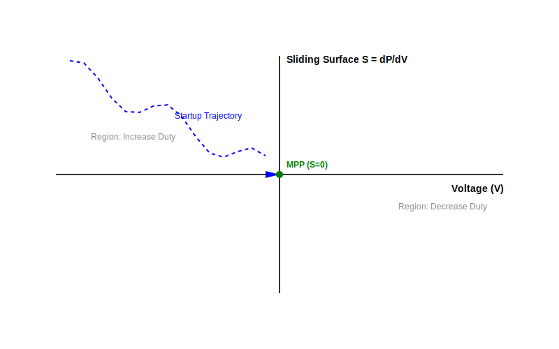

# Sliding Mode Control (SMC) MPPT Documentation

## 1. Overview
The YASL firmware (v2.3.1+) utilizes an advanced **Sliding Mode Control (SMC)** algorithm for Maximum Power Point Tracking (MPPT). Unlike traditional Perturb and Observe (P&O) methods, SMC provides a more robust and faster response to rapid environmental changes (e.g., passing clouds) by defining a "sliding surface" in the state space that the system is forced to follow.

## 2. The Sliding Surface
In solar power systems, the goal is to operate at the Maximum Power Point (MPP), where the derivative of power ($P$) with respect to voltage ($V$) is zero:
$$\frac{dP}{dV} = 0$$

We define our sliding surface ($S$) as:
$$S = \frac{dP}{dV} \approx \frac{\Delta P}{\Delta V}$$

### Control Law
The control law aims to drive the system towards $S = 0$:
- If $S > 0$: The system is to the left of the MPP. Increase voltage (decrease duty cycle).
- If $S < 0$: The system is to the right of the MPP. Decrease voltage (increase duty cycle).

In the firmware implementation:
```cpp
if (S > target_S + SMC_S_HYSTERESIS) {
    if (sys.mpptPWM > 0) sys.mpptPWM -= (int)ceil(current_gain);
} else if (S < target_S - SMC_S_HYSTERESIS) {
    if (sys.mpptPWM < MPPT_PWM_MAX_RES) sys.mpptPWM += (int)ceil(current_gain);
}
```

## 3. Phase Portrait and Stability
The "Phase Portrait" below illustrates the system trajectory in the $(V, dP/dV)$ plane.



### Reachability Condition
The system enters the "Sliding Mode" when the trajectory hits the surface $S=0$. For the system to be stable and "slide" along this surface towards the MPP, the reachability condition must be met:
$$S \cdot \dot{S} < 0$$
This ensures that if the system deviates from the surface, the control action forces it back.

### Chattering and Hysteresis
To prevent "chattering" (high-frequency oscillation across the sliding surface), we implement `SMC_S_HYSTERESIS`. This creates a small dead-band around the MPP where the duty cycle remains stable, significantly improving efficiency in steady-state conditions.

## 4. Adaptive Gain
The firmware utilizes an adaptive gain mechanism:
- **Sensed Mode (INA219):** High confidence allows for high gain (`SMC_SENSED_GAIN_MULT`), resulting in near-instantaneous tracking.
- **Sensorless Mode (Inference):** Uses lower gain and a `SMC_SENSORLESS_BIAS` to ensure stability when operating on estimated data.
- **Power Scaling:** Gain is automatically reduced at low light levels to prevent noise-induced oscillations.

## 5. Synchronous Rectification Benefits
In v2.4.0, the introduction of synchronous rectification (Complementary PWM with deadtime) allows the Buck converter to operate in **Continuous Conduction Mode (CCM)** even at very low loads. This keeps the $dP/dV$ gradients clean and predictable, whereas asynchronous (diode) converters suffer from non-linear behavior in Discontinuous Conduction Mode (DCM), which can confuse the SMC algorithm.
