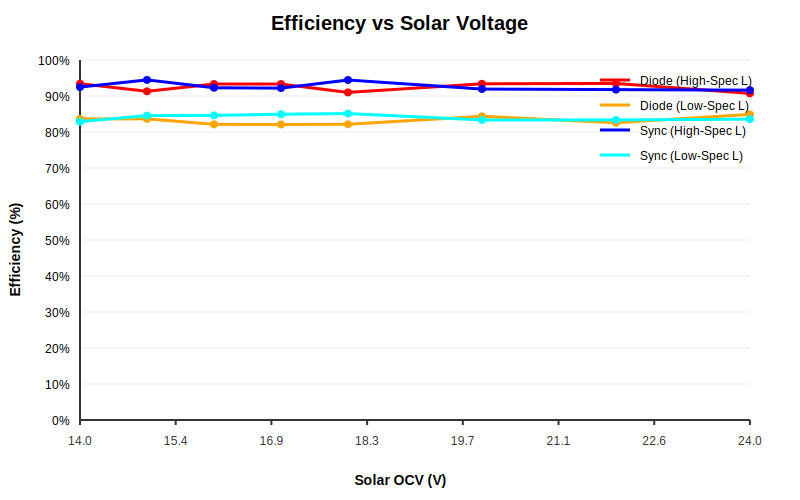
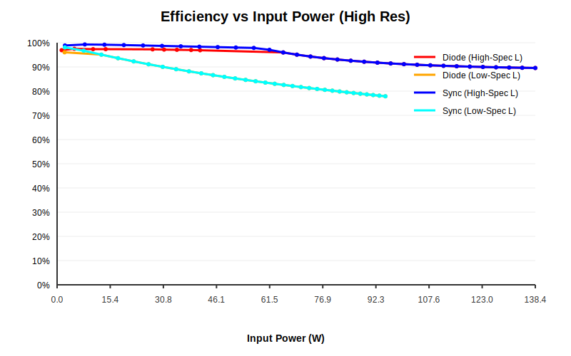

# MPPT Efficiency Benchmarking Report

Comparative analysis of Diode (v2.3.1) vs Synchronous (v2.4.0) rectification across multiple hardware grades.

## 1. Efficiency vs Solar Voltage

## 2. Efficiency vs Input Power

## 3. Hardware Comparison Summary

| Configuration | Inductor Spec | Peak Efficiency | 20W Efficiency |
| :--- | :--- | :---: | :---: |
| Diode | High-Spec | 93.5% | 89.8% |
| Diode | Low-Spec | 89.1% | 88.2% |
| Sync | High-Spec | 95.3% | 92.8% |
| Sync | Low-Spec | 91.0% | 91.0% |
