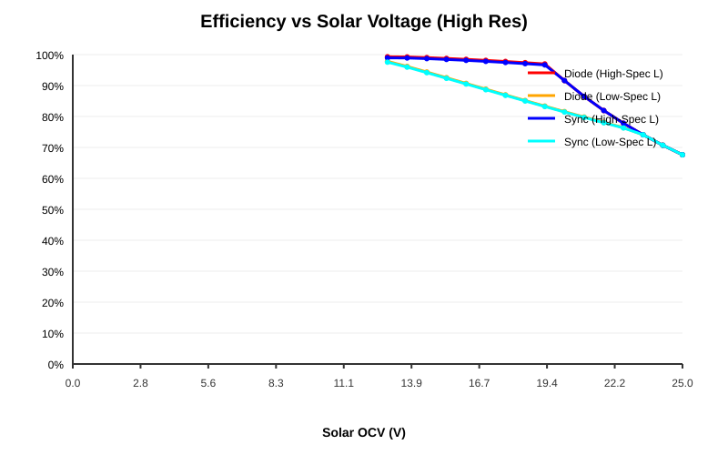
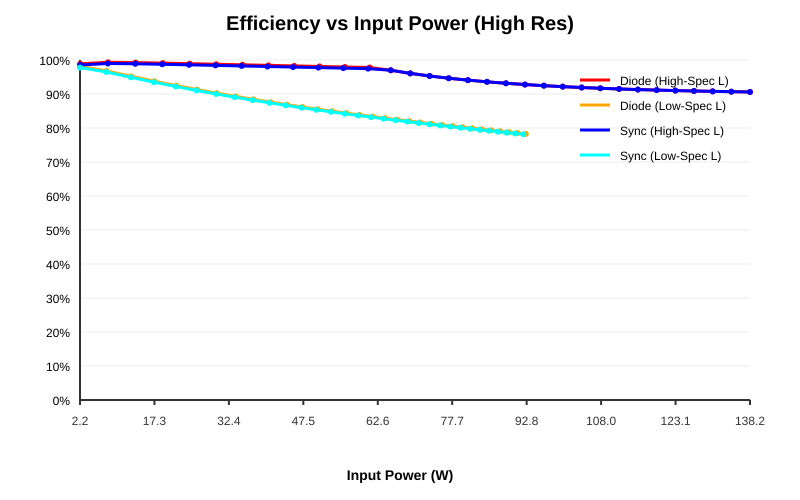

# MPPT Efficiency Benchmarking Report (High Res)

Analysis of Synchronous vs Asynchronous (Diode) rectification. Solar sweep from 0V to 25V.

## 1. Efficiency vs Solar Voltage

## 2. Efficiency vs Input Power

## 3. Hardware Comparison Summary

| Configuration | Inductor Spec | Peak Efficiency | 40W Efficiency |
| :--- | :--- | :---: | :---: |
| Diode | High | 99.3% | 98.4% |
| Diode | Low | 96.8% | 87.6% |
| Sync | High | 99.0% | 98.1% |
| Sync | Low | 96.5% | 87.4% |
