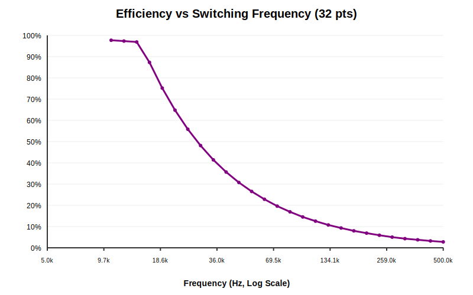

# Influence of Switching Frequency on Efficiency

High-resolution sweep of switching frequency from 5kHz to 500kHz.

| Frequency (kHz) | Efficiency | Pin (W) |
| :--- | :---: | :---: |
| 5.0 | 0.0% | 20.0 |
| 5.8 | 0.0% | 20.0 |
| 6.7 | 0.0% | 20.0 |
| 7.8 | 0.0% | 20.0 |
| 9.1 | 0.0% | 20.0 |
| 10.5 | 97.7% | 20.0 |
| 12.2 | 97.3% | 20.0 |
| 14.1 | 96.9% | 20.0 |
| 16.4 | 87.3% | 20.0 |
| 19.0 | 75.2% | 20.0 |
| 22.1 | 64.8% | 20.0 |
| 25.6 | 55.8% | 20.0 |
| 29.7 | 48.1% | 20.0 |
| 34.5 | 41.4% | 20.0 |
| 40.0 | 35.7% | 20.0 |
| 46.4 | 30.7% | 20.0 |
| 53.9 | 26.5% | 20.0 |
| 62.5 | 22.9% | 20.0 |
| 72.5 | 19.6% | 20.0 |
| 84.1 | 16.9% | 20.0 |
| 97.6 | 14.5% | 20.0 |
| 113.2 | 12.5% | 20.0 |
| 131.3 | 10.8% | 20.0 |
| 152.3 | 9.3% | 20.0 |
| 176.7 | 8.0% | 20.0 |
| 205.1 | 6.9% | 20.0 |
| 237.9 | 5.9% | 20.0 |
| 276.0 | 5.0% | 20.0 |
| 320.2 | 4.3% | 20.0 |
| 371.5 | 3.8% | 20.0 |
| 431.0 | 3.2% | 20.0 |
| 500.0 | 2.8% | 20.0 |
